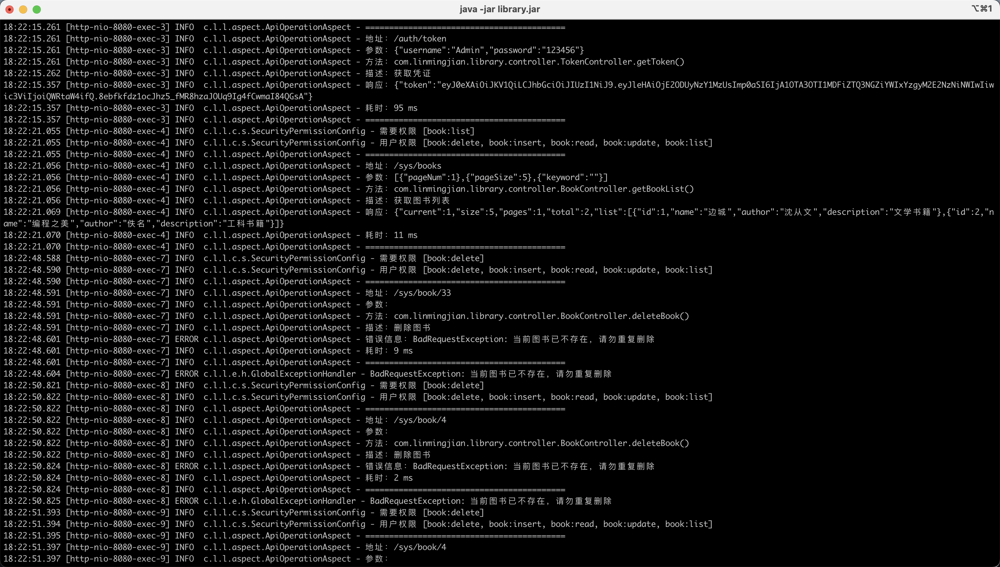
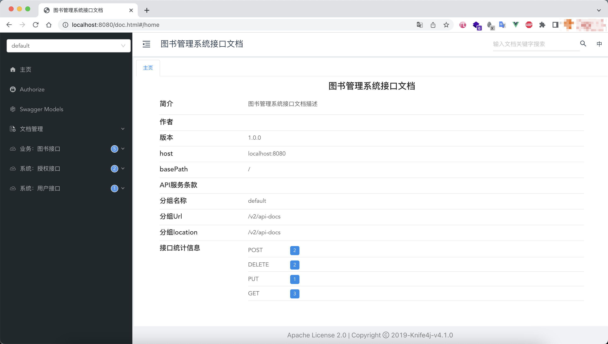

### 图书管理系统（API)

#### 项目简介
基于 Spring Boot、 Spring Security、MyBatis Plus 、JWT、Ehcache 开发的管理系统（API）

#### 项目选型
> 根据要求要体现出登录、权限控制、分层、日志、缓存、数据库、基于环境的配置分离等特性

- 登录
  - 使用JWT作为鉴权机制，签发对应的token
- 权限控制
  - 基于RBAC，设计了用户、角色、权限等关联关系，使用Spring Security针对不同用户角色权限，进行接口访问控制。
- 分层
  - 项目结构采用maven聚合形式进行模块开发，模块内部再依据功能划分成细小的模块
    - 比如常见的bean，划分如下
      - entity 对标表实体
      - dto 对标接口传输参数
      - vo 对标接口响应参数
- 日志
  - 使用自带`logback`日志进行日志输出，使用slf4j门面进行日志打印，实现了接口日志前面针对使用`ApiOperation`注解的接口，进行日志打印，后期也可以根据需求调整保存数据库等操作。
- 缓存
  - 鉴于项目本身需要快速部署，使用了`ehcache`+`spring cache`的组合，作为内存缓存进行使用。
- 数据库
  - 使用`H2`数据库作为数据存储，`MyBatis Plus`作为半ORM框架进行快速数据访问。
- 环境配置
  - 根据启动文件不同，如`dev`、`prod`等切换不同配置项
- swagger
  - 使用 `Knife4j` 集成 `swagger` 文档

#### 项目结构
项目采用模块聚合形式划分模块进行开发，后续可按照需求进行扩展
- `lib-common` 系统的公共模块，通用的配置和工具类存放在该模块
- `lib-web`系统的核心模块，也是项目入口模块，对外暴露相关服务接口
- `lib-xxx`后续可以按需扩展如其他第三方工具包、或者其他服务模块

#### 详细结构
```
- lib-common   公共模块
    - aspect   自定义切面
    - base     数据基类
    - config   配置类
    - exceptin 统一异常相关
- lib-web      系统入口模块
    - controller  控制器
    - service     服务
        - impl    服务实现
    - repository  数据层
    - bean        数据bean
```

#### 接口文档
访问对应启动服务的文档页，如 [http://localhost:8080/doc.html](http://localhost:8080/doc.html)

#### 启动要求
需要具备JDK1.8以上环境
```shell
 ## 默认开发环境
 java -jar library.jar
 
 ## 正式环境
 java -jar library.jar --spring.profiles.active=prod
```
超级管理员账号密码：Admin/123456

数据管理员账号密码：Hainan/12345

#### 截图





#### 后续可扩展
- 凭证接口传输密码加密，如使用RSA非对称加密，前端公钥加密，后端私钥解密，增加验证码、限流等机制。
- 引入`MapStruct`等库，完成不同`bean`的快速转换


